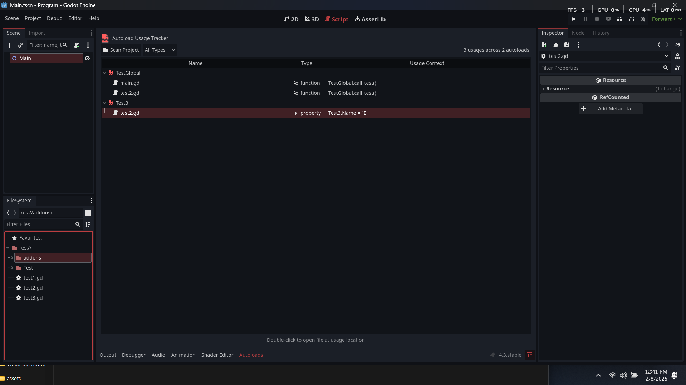

# Godot Autoload Tracker Plugin
Editor plugin for Godot 4.x that helps you visualize and manage your autoloads (singleton) usage across your project.

## Installation
1. Clone or download this repository
2. Copy the `addons/autoload_tracker` folder into your Godot project's `addons` folder
3. Enable the plugin in Project → Project Settings → Plugins
4. The Autoload Tracker will appear in the toolbar and as a dock on the right side

## License
MIT License - See [LICENSE](LICENSE) for details

Created by Miisan with love:PP 